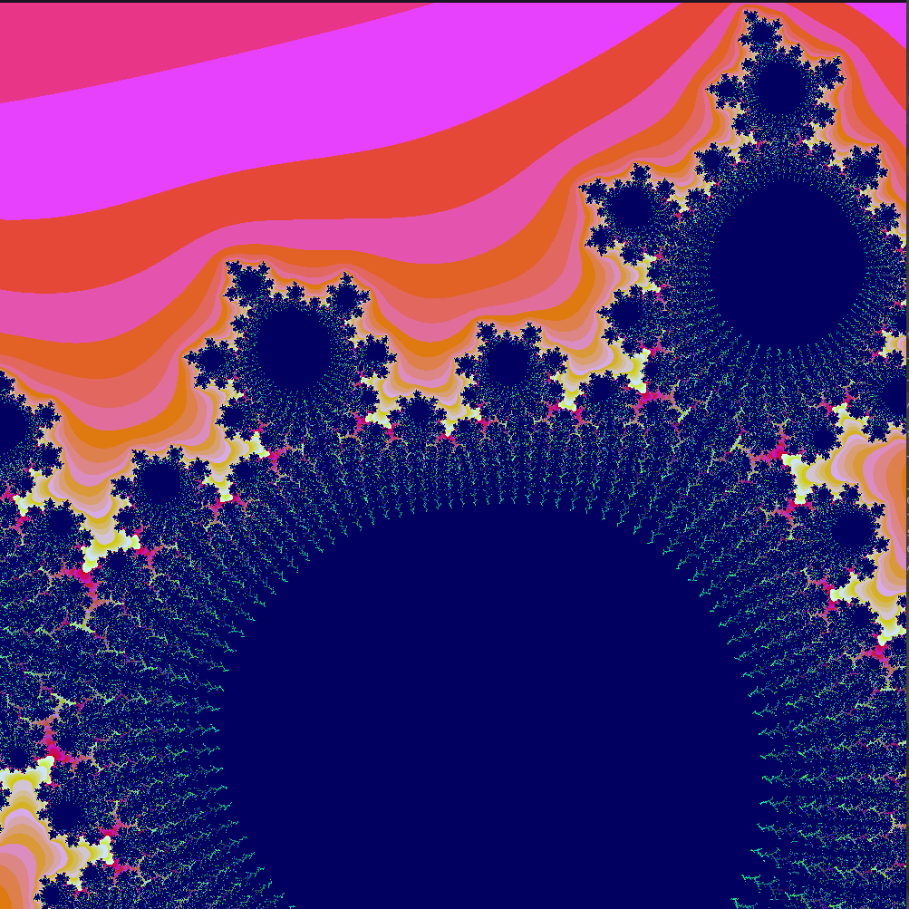
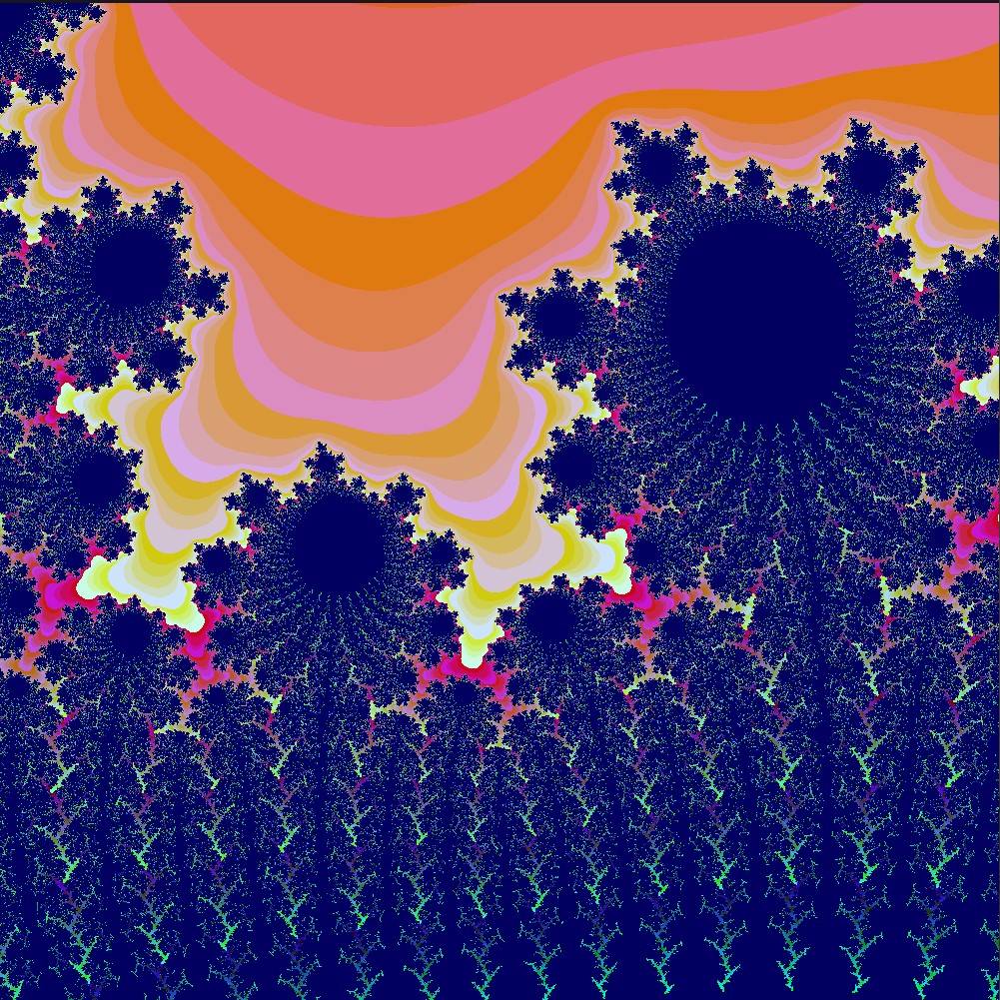
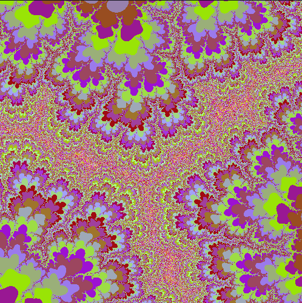
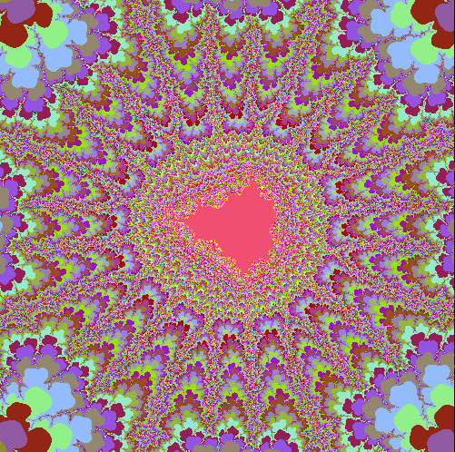
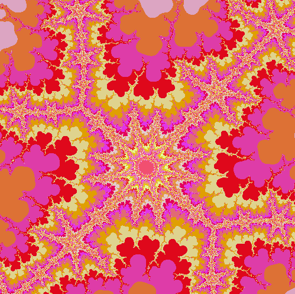
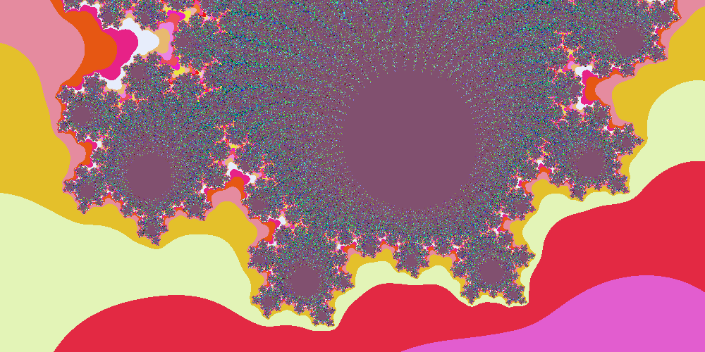

<h3 align="center">42 São Paulo - fract-ol</h3>

<div align="center">


</div>

<p align="center"> A fractal navigator for the Julia and Mandelbrot sets.
  <br>
</p>

---

## 📜 Table of Contents

- [About](#about)
- [Checklist](#checklist)
- [Getting Started](#getting_started)
- [Controls](#controls)
- [Gallery](#gallery)
- [Notes](#notes)
- [42 São Paulo](#ft_sp)
- [Resources](#resources)

## 🧐 About <a name = "about"></a>

## ✅ Checklist <a name = "checklist"></a>

## 🏁 Getting Started <a name = "getting_started"></a>

### ⚙️ Prerequisites

This will only compile on Linux and FreeBSD.

You will need a C compiler (`gcc` or `clang`)
and [minilibx](https://github.com/42Paris/minilibx-linux),
an X-Window API in C made by 42 Paris:

```bash
# Clone the repo
git clone https://github.com/42Paris/minilibx-linux.git
cd minilibx-linux

# Install dependencies and build
sudo apt install libxext-dev libxrandr-dev libx11-dev libbsd-dev libssl-dev
make

# Copy archive and headers to system path
sudo cp libmlx.a /usr/local/lib/
sudo cp mlx.h /usr/local/include/
sudo cp mlx_int.h /usr/local/include/

# Add pages to man (optional)
sudo mkdir /usr/local/man/man1
sudo cp man/man1/* /usr/local/man/man1/
man mlx
```

### 🖥️ Installing

Clone the repo and build with `make`:

```bash
$ git clone https://github.com/librity/ft_fractol.git
$ cd ft_fractol
$ make required
```

This should open a new window with a beautiful fractal.

## 🕹️ Controls <a name="controls"></a>

- `Esc` or `q`: Exits program
- `=` and `-`: Zoom in and out
- `Mouse Wheel`: Zoom in and out
- `Arrow Keys`: Moves the fractal
- `Mouse Left Click`: Warp to clicked pixel
- `c`: Switches color mode
- `l` and `.`: Shifts color bases up and down
- `i` and `k`: Increases and decreases iterations
- `t` and `g`: Increases and decreases infinity
- `s`: Saves viewport to bitmap

## 🎨 Gallery <a name="gallery"></a>

<p align="center">
  
</p>

<p align="center">
  
</p>

<p align="center">
  
</p>

<p align="center">
  
</p>

<p align="center">
  
</p>

<p align="center">
  
</p>

[and much, much more...](https://github.com/librity/ft_fractol/tree/main/gallery)

## 📝 Notes <a name = "notes"></a>

## 🛸 42 São Paulo <a name = "ft_sp"></a>

Part of the larger [42 Network](https://www.42.fr/42-network/),
[42 São Paulo](https://www.42sp.org.br/) is a software engineering school
that offers a healthy alternative to traditional education:

- It doesn't have any teachers and classes.
- Students learn by cooperating
  and correcting each other's work (peer-to-peer learning).
- Its focus is as much on social skills as it is on technical skills.
- It's completely free to anyone that passes its selection process -
  [**The Piscine**](https://42.fr/en/admissions/42-piscine/)

It's an amazing school, and I'm grateful for the opportunity.

## 📚 Resources <a name = "resources"></a>
