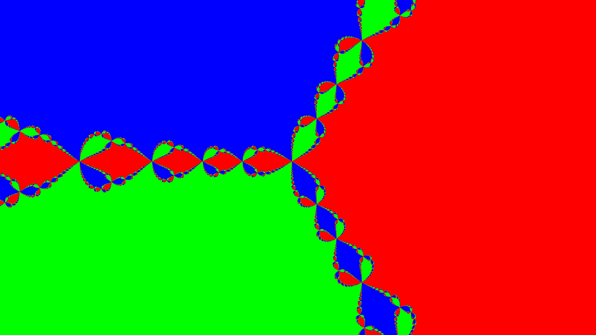

<h3 align="center">42 São Paulo - fract-ol</h3>

<div align="center">

[](https://github.com/librity/ft_fractol/actions/workflows/norminette_v3.yml)


</div>

<p align="center"> A fractal navigator for the Julia and Mandelbrot sets.
  <br>
</p>

---

## 📜 Table of Contents

- [About](#about)
- [Checklist](#checklist)
- [Getting Started](#getting_started)
- [Controls](#controls)
- [Gallery](#gallery)
- [Notes](#notes)
- [42 São Paulo](#ft_sp)
- [Resources](#resources)

## 🧐 About <a name = "about"></a>

## ✅ Checklist <a name = "checklist"></a>

### Mandatory

- [x] Compiles with `-Wall -Wextra -Werror`
- [x] `.linux` file (42 Workspaces)
- [x] Makefile rules: `$(NAME)` `all` `clean` `fclean` `re`
- [x] Follows `norminette 3.3.51`
- [x] Should not quit unexpectedly (segmentation fault, bus error, double
      free, etc.)
- [x] All allocated heap memory properly freed, no memory leaks.
  - [x] Check memory leaks with `valgrind`
- [x] Program name `fractol`
- [x] Test in workspaces
- [x] Turn in `Makefile`, `*.h`, `*.c` , `.linux` , `.gitignore`
- [x] DON’T turn in libs as submodules.
- [x] Recieves the fractal type as arguments
  - [x] Bad arguments: exits properly with a help message
- [x] Allowed functions:
  - [x] open, close, read, write, malloc, free, perror, strerror, exit
  - [x] All `math.h`
  - [x] All `mlx.h`
  - [x] All `libft.h`
  - [x] Your `ft_printf` (may be modified)
    - [x] No `printf` from `stdio.h`
- [x] Must use `MiniLibX`
- [x] Make must compile without relinking
- [x] No global variables
- [x] Renders Mandelbrot
- [x] Renders Julia
  - [x] Receives Julia factor as arguments
- [x] Handles zoom with mouse wheel
- [x] Renders fractals with colors gradients proportional to iterations
- [x] Smooth window management (minimizing, focus switch, etc.)
- [x] ESC closes the program cleanly
- [x] Clicking the window's `x` button closes the program cleanly
- [x] Must use MiniLibX’s `images` (no `mlx_pixel_put`)

### Bonus

- [x] Render another fractal of your choice
- [x] Zoom follows mouse position
- [x] Arrow keys move the view
- [x] Changes color on keypress

### Extra Features

- [x] Add LERP color mode
- [x] Add Bernstein polynomials color mode
- [x] Save to .bmp on keypress
- [x] Change `max_iterations` on keypress
- [x] Change `infinity` on keypress
- [x] Add tests with `minunit.h`
- [ ] Render with threads (optimization).
- [ ] Change julia parameters on keypress
- [ ] Fullscreen mode on keypress
- [ ] Switch fractal on keypress
- [ ] Random colors on keypress
- [ ] Add anti-aliasing

## 🏁 Getting Started <a name = "getting_started"></a>

### ⚙️ Prerequisites

This will only compile on Linux and FreeBSD.

You will need a C compiler (`gcc` or `clang`)
and [minilibx](https://github.com/42Paris/minilibx-linux),
an X-Window API in C made by 42 Paris:

```bash
# Clone the repo
git clone https://github.com/42Paris/minilibx-linux.git
cd minilibx-linux

# Install dependencies and build
sudo apt install libxext-dev libxrandr-dev libx11-dev libbsd-dev libssl-dev
make

# Copy archive and headers to system path
sudo cp libmlx.a /usr/local/lib/
sudo cp mlx.h /usr/local/include/

# Add pages to man (optional)
sudo mkdir /usr/local/man/man1
sudo cp man/man1/* /usr/local/man/man1/
man mlx
```

### 🖥️ Installing

Clone the repo and build with `make`:

```bash
$ git clone https://github.com/librity/ft_fractol.git
$ cd ft_fractol
$ make
$ fractol mandelbrot
```

This should open a new window rendering the mandelbrot fractal.
You can also render the julia set (that requires a complex factor),
and the Newton fractal of the polynomial `z^3 - 1`:

```bash
$ fractol julia -0.391 -0.587
$ fractol newton
```

## 🕹️ Controls <a name="controls"></a>

- `Esc` or `q`: Exit program
- `=` and `-`: Zoom in and out
- `Mouse Wheel`: Zoom in and out
- `Arrow Keys`: Move fractal position
- `Mouse Left Click`: Warp to clicked pixel
- `c`: Switch color mode
- `l` and `.`: Shift color bases up and down
- `i` and `k`: Increase and decrease iterations
- `t` and `g`: Increase and decrease infinity
- `s`: Save viewport to bitmap

## 🎨 Gallery <a name="gallery"></a>

<p align="center">
  
</p>

<p align="center">
  
</p>

<p align="center">
  
</p>

<p align="center">
  
</p>

<p align="center">
  
</p>

<p align="center">
  
</p>

<p align="center">
  
</p>

<p align="center">
  
</p>

<p align="center">
  
</p>

<p align="center">
  
</p>

<p align="center">
  
</p>

<p align="center">
  
</p>

[and much, much more...](https://github.com/librity/ft_fractol/tree/main/gallery)

## 📝 Notes <a name = "notes"></a>

## 🛸 42 São Paulo <a name = "ft_sp"></a>

Part of the larger [42 Network](https://www.42.fr/42-network/),
[42 São Paulo](https://www.42sp.org.br/) is a software engineering school
that offers a healthy alternative to traditional education:

- It doesn't have any teachers and classes.
- Students learn by cooperating
  and correcting each other's work (peer-to-peer learning).
- Its focus is as much on social skills as it is on technical skills.
- It's completely free to anyone that passes its selection process -
  [**The Piscine**](https://42.fr/en/admissions/42-piscine/)

It's an amazing school, and I'm grateful for the opportunity.

## 📚 Resources <a name = "resources"></a>

### minilibx

- https://harm-smits.github.io/42docs/libs/minilibx
- https://gontjarow.github.io/MiniLibX/
- https://aurelienbrabant.fr/blog/managing-events-with-the-minilibx
- https://aurelienbrabant.fr/blog/pixel-drawing-with-the-minilibx
- https://aurelienbrabant.fr/blog/getting-started-with-the-minilibx
- https://github.com/42sp/minilibx-linux
- https://github.com/42Paris/minilibx-linux/issues/24
- http://cyber.dabamos.de/unix/x11/
- https://qst0.github.io/ft_libgfx/man_mlx.html
- https://gontjarow.github.io/MiniLibX/mlx-tutorial-create-image.html
- https://elearning.intra.42.fr/notions/minilibx/subnotions
- https://elearning.intra.42.fr/tags/716/notions

### minilibx functions

```c
void	*mlx_init();
void	*mlx_new_window(void *mlx_ptr, int size_x, int size_y, char *title);
int	mlx_clear_window(void *mlx_ptr, void *win_ptr);
int	mlx_pixel_put(void *mlx_ptr, void *win_ptr, int x, int y, int color);
void	*mlx_new_image(void *mlx_ptr,int width,int height);
char	*mlx_get_data_addr(void *img_ptr, int *bits_per_pixel,
			   int *size_line, int *endian);
int	mlx_put_image_to_window(void *mlx_ptr, void *win_ptr, void *img_ptr,
				int x, int y);
int	mlx_get_color_value(void *mlx_ptr, int color);
int	mlx_mouse_hook (void *win_ptr, int (*funct_ptr)(), void *param);
int	mlx_key_hook (void *win_ptr, int (*funct_ptr)(), void *param);
int	mlx_expose_hook (void *win_ptr, int (*funct_ptr)(), void *param);
int	mlx_loop_hook (void *mlx_ptr, int (*funct_ptr)(), void *param);
int	mlx_loop (void *mlx_ptr);
int mlx_loop_end (void *mlx_ptr);
int	mlx_string_put(void *mlx_ptr, void *win_ptr, int x, int y, int color,
		       char *string);
void	mlx_set_font(void *mlx_ptr, void *win_ptr, char *name);
void	*mlx_xpm_to_image(void *mlx_ptr, char **xpm_data,
			  int *width, int *height);
void	*mlx_xpm_file_to_image(void *mlx_ptr, char *filename,
			       int *width, int *height);
int	mlx_destroy_window(void *mlx_ptr, void *win_ptr);
int	mlx_destroy_image(void *mlx_ptr, void *img_ptr);
int	mlx_destroy_display(void *mlx_ptr);
int	mlx_hook(void *win_ptr, int x_event, int x_mask,
                 int (*funct)(), void *param);
int	mlx_do_key_autorepeatoff(void *mlx_ptr);
int	mlx_do_key_autorepeaton(void *mlx_ptr);
int	mlx_do_sync(void *mlx_ptr);
int	mlx_mouse_get_pos(void *mlx_ptr, void *win_ptr, int *x, int *y);
int	mlx_mouse_move(void *mlx_ptr, void *win_ptr, int x, int y);
int	mlx_mouse_hide(void *mlx_ptr, void *win_ptr);
int	mlx_mouse_show(void *mlx_ptr, void *win_ptr);
int	mlx_get_screen_size(void *mlx_ptr, int *sizex, int *sizey);
```

### Fractals

- https://en.wikipedia.org/wiki/Fractal
- https://en.wikipedia.org/wiki/List_of_fractals_by_Hausdorff_dimension
- https://elearning.intra.42.fr/notions/fract-ol/subnotions
- https://en.wikipedia.org/wiki/Mandelbrot_set
- https://pt.mathigon.org/course/fractals/mandelbrot
- https://repositorio.bc.ufg.br/tede/bitstream/tede/6343/5/Dissertação - Márcio Vaiz dos Reis - 2016.pdf
- https://www.youtube.com/watch?v=eN8e6CJwdZU
- https://docs.ufpr.br/~ewkaras/ensino/fractais/Julia_Mandelbrot.pdf
- https://www.codingame.com/playgrounds/2358/how-to-plot-the-mandelbrot-set/mandelbrot-set
- https://theses.liacs.nl/pdf/2018-2019-JonckheereLSde.pdf
- https://fractalfoundation.org/fractivities/FractalPacks-EducatorsGuide.pdf
- https://discord.com/channels/706206701598277681/854438469614174228/940281570332405760
- https://www.wikihow.com/Plot-the-Mandelbrot-Set-By-Hand
- https://www.geogebra.org/m/jcpvtkhz

### Mandelbrot set

- https://en.wikipedia.org/wiki/Mandelbrot_set
- https://en.wikipedia.org/wiki/Plotting_algorithms_for_the_Mandelbrot_set
- https://github.com/giyeo/giyeo/wiki/O-Conjunto-de-Mandelbrot

### Julia set

- https://en.wikipedia.org/wiki/Julia_set
- https://mathworld.wolfram.com/JuliaSet.html

### Tricorn

- https://en.wikipedia.org/wiki/Tricorn_(mathematics)

### **Burning Ship**

- https://en.wikipedia.org/wiki/Burning_Ship_fractal

### Newton Fractal

- https://en.wikipedia.org/wiki/Newton_fractal
- https://en.wikipedia.org/wiki/Newton's_method

### https://github.com/jcponce

- https://github.com/jcponce/jcponce.github.io
- https://www.dynamicmath.xyz/mandelbrot-julia/
- https://github.com/jcponce/complex

### OneLoneCoder

- https://www.youtube.com/watch?v=PBvLs88hvJ8
- https://github.com/OneLoneCoder/olcPixelGameEngine/blob/master/Videos/OneLoneCoder_PGE_Mandelbrot.cpp

### Window Viewport

- https://www.geeksforgeeks.org/window-to-viewport-transformation-in-computer-graphics-with-implementation/

### Videos

- https://www.youtube.com/watch?v=9gk_8mQuerg
- https://www.youtube.com/watch?v=LqbZpur38nw
- https://www.youtube.com/watch?v=FFftmWSzgmk
- https://www.youtube.com/watch?v=9U0XVdvQwAI
- https://www.youtube.com/watch?v=ovJcsL7vyrk
- https://www.youtube.com/watch?v=N8WWodGk9-g
- https://www.youtube.com/watch?v=GiAj9WW1OfQ

### Math

- https://fractalfoundation.org/fractivities/FractalPacks-EducatorsGuide.pdf
- http://www.opengl-tutorial.org/beginners-tutorials/tutorial-3-matrices/

### Luc de Jonckheere’s Thesis

- https://theses.liacs.nl/pdf/2018-2019-JonckheereLSde.pdf
- https://gmplib.org/manual/Floating_002dpoint-Functions
- https://ieeexplore.ieee.org/document/4610935
- https://www.math.univ-angers.fr/~tanlei/papers/similarityMJ.pdf
- https://users.math.yale.edu/~bbm3/web_pdfs/encyclopediaBritannica.pdf

### Fractal Software

- https://github.com/search?o=desc&q=fractal&s=stars&type=Repositories
- https://github.com/fract4d/gnofract4d
- https://fractint.org/
- https://fractalwiki.org/wiki/SuperFractalThing
- https://mathr.co.uk/
- https://github.com/cveld/blazor-mandelbrot-deepzoom
- https://github.com/munrocket/deep-mandelbrot
- https://github.com/JMaio/deep-fractal
- https://jmaio.dev/deep-fractal/
- https://xaos-project.github.io/
- https://github.com/michele-summo/ms-xaos
- https://github.com/xaos-project
- https://github.com/xaos-project/XaoS
- https://github.com/xaos-project/XaoSjs
- https://xaos-project.github.io/XaoSjs/
- https://github.com/HackerPoet/MarbleMarcher
- https://github.com/jonnyhyman/Chaos
- https://github.com/HackerPoet/PySpace
- https://github.com/HackerPoet/FractalSoundExplorer

### Map

- https://github.com/processing/p5.js/blob/main/src/math/calculation.js#L451

### `valgrind`

- https://valgrind.org/
- https://github.com/pmem/valgrind
- https://www.cprogramming.com/debugging/valgrind.html
- https://stackoverflow.com/questions/67040349/valgrind-gives-error-memory-still-reachable
- https://www.handlebar-online.com/usefull-tips/what-does-valgrind-still-reachable-mean/

### GCC `-fsanitize=address` `-fsanitize=leak`

- Faster than `valgrind` , but detects less leaks.
- Incompatible with valgrind
- Probably slows down runtime
- https://stackoverflow.com/questions/11524960/memory-leaks-not-detected-by-crt-memory-leak-detection
- https://stackoverflow.com/questions/31210053/gcc-and-fsanitize-leak
- https://stackoverflow.com/questions/65572114/how-does-fsanitize-leak-affect-runtime-performance

```c
// Won't detect this leak
int	main(void)
{
	void	*ptr;
	ptr = malloc(8);
	return (0);
}
```

### Debug Flag `-g`

- https://stackoverflow.com/questions/24117063/is-a-program-compiled-with-g-gcc-flag-slower-than-the-same-program-compiled-wit

### Optimization Flags

- `-O3` and `-O2`
- https://www.rapidtables.com/code/linux/gcc/gcc-o.html

### Minilibx close window on red cross click

- https://harm-smits.github.io/42docs/libs/minilibx/events.html#test-your-skills
- https://tronche.com/gui/x/xlib/events/

### X Server/**X11/X Window System**

- https://en.wikipedia.org/wiki/X_Window_System
- https://duckduckgo.com/?q=x11+fullscreen+window&t=brave&atb=v1-1&ia=web
- https://stackoverflow.com/questions/1829706/how-to-query-x11-display-resolution
- https://stackoverflow.com/questions/9083273/x11-fullscreen-window-opengl
- https://www.tonyobryan.com/index.php?article=9

### Wayland

- https://en.wikipedia.org/wiki/Wayland_(display_server_protocol)#Differences_between_Wayland_and_X

### Zoom

- https://www.youtube.com/watch?v=ixFCsST2pF4
- https://iq.opengenus.org/power-exponential-math-h-c/

### \***\*GNU Multiple Precision Arithmetic Library\*\***

- https://en.wikipedia.org/wiki/GNU_Multiple_Precision_Arithmetic_Library
- https://github.com/HowJnB/gmp
- https://gmplib.org/

### Nvidia **Compute Unified Device Architecture**

- https://en.wikipedia.org/wiki/CUDA
- https://www.youtube.com/watch?v=RaCPrXYOiRE

### C Optimizations

- https://stackoverflow.com/questions/54297525/fast-way-to-get-a-close-power-of-2-number-floating-point

### Coloring Algorithms

- https://www.mi.sanu.ac.rs/vismath/javier/b1.htm
- https://math.stackexchange.com/questions/4035/continuous-coloring-of-a-mandelbrot-fractal
- https://www.uvm.edu/~msargent/fractals/
- https://www.fractalus.com/fractint/dmj-pub.htm
- https://www.researchgate.net/publication/266018231_Fractals_and_multi_layer_coloring_algorithms
- https://www.ultrafractal.com/help/index.html?/help/coloring/coloring.html

### Escape-Time Algorithm

- https://en.wikipedia.org/wiki/Plotting_algorithms_for_the_Mandelbrot_set#Escape_time_algorithm
- https://www.mi.sanu.ac.rs/vismath/javier/b2.htm

### Linear Interpolation (lerp)

- https://en.wikipedia.org/wiki/Linear_interpolation
- https://github.com/processing/p5.js/blob/main/src/math/calculation.js#L311
- https://p5js.org/reference/#/p5/lerp
- https://github.com/processing/p5.js/blob/aa47d5025162edb66abeb70e9912a50bcb63edaa/src/color/creating_reading.js#L401

### Color Gradients

- https://learncplusplus.org/learn-to-generate-beautiful-color-gradients-in-c-builder/
- https://www.py4u.net/discuss/2538256
- https://www.color-hex.com/

### Bernstein polynomials Color

- https://theses.liacs.nl/pdf/2018-2019-JonckheereLSde.pdf
- https://en.wikipedia.org/wiki/Bernstein_polynomial

```c
r(t) = 9 ∗ (1 − t) ∗ t^3 ∗ 255
g(t) = 15 ∗ (1 − t)^2 ∗ t^2 ∗ 255
b(t) = 8.5 ∗ (1 − t)^3 ∗ t ∗ 255
```

### Graphic Effects

- https://en.wikipedia.org/wiki/Computer_graphics
- https://en.wikipedia.org/wiki/2D_computer_graphics
- https://en.wikipedia.org/wiki/Pixel-art_scaling_algorithms

### Anti-Aliasing (NOT A FILTER)

- Rendering fractals inevitably causes aliasing (undesirable artifacts)
- We remove aliasing by getting more samples (rendering at a higher resolution), then taking their average to get the final color value for the pixel.
- https://www.fractalus.com/info/antialias.htm
- https://en.wikipedia.org/wiki/Aliasing
- https://en.wikipedia.org/wiki/Anti-aliasing_filter
- https://en.wikipedia.org/wiki/Temporal_anti-aliasing
- https://en.wikipedia.org/wiki/Fast_approximate_anti-aliasing
- https://en.wikipedia.org/wiki/Multisample_anti-aliasing
- https://en.wikipedia.org/wiki/Spatial_anti-aliasing
- https://en.wikipedia.org/wiki/Supersampling
- https://stackoverflow.com/questions/3011274/antialiasing-algorithm
- https://en.wikipedia.org/wiki/Nyquist–Shannon_sampling_theorem

### Blur Filters

- They don’t improve the image, they just make it blury.
- https://www.geeksforgeeks.org/box-blur-algorithm-with-python-implementation/
- https://en.wikipedia.org/wiki/Box_blur
- https://en.wikipedia.org/wiki/Gaussian_blur
- https://github.com/liamfotheringham/Mandelbrot-Gaussian-Blur

### **Anisotropic filters**

- Enhances texture quality seen at oblique angles.
- https://en.wikipedia.org/wiki/Mipmap
- https://en.wikipedia.org/wiki/Anisotropic_filtering
- https://en.wikipedia.org/wiki/Bilinear_interpolation
- https://en.wikipedia.org/wiki/Trilinear_filtering

### Bitwise Operations

- https://en.wikipedia.org/wiki/Bitwise_operations_in_C

### `pthread.h`

- https://www.man7.org/linux/man-pages/man0/pthread.h.0p.html
- https://iq.opengenus.org/multithreading-and-pthread-in-c/
- https://www.geeksforgeeks.org/multithreading-c-2/
- https://www.tutorialspoint.com/multithreading-in-c
- https://github.com/samuelpio01/multithreading-in-c/blob/master/pthread_multithreading.c

### `ft_ftoa`, `ft_dtoa`, `ft_ldtoa`

- https://www.geeksforgeeks.org/convert-floating-point-number-string/
- https://stackoverflow.com/questions/32659336/getting-the-exponent-from-a-floating-point-in-c
- https://stackoverflow.com/questions/5589383/extract-fractional-part-of-double-efficiently-in-c
- https://www.cplusplus.com/reference/cmath/modf/
- https://www.cplusplus.com/reference/cmath/remainder/
- https://stackoverflow.com/questions/4264127/correct-format-specifier-for-double-in-printf

```c
sizeof(int): 4
sizeof(long): 8
sizeof(long long): 8
sizeof(float): 4
sizeof(double): 8
sizeof(long double): 16
```

### `ft_atof`, `ft_atold`

- https://www.geeksforgeeks.org/atol-atoll-and-atof-functions-in-c-c/
- https://stackoverflow.com/questions/52391330/create-a-precise-atof-implementation-in-c
- https://www.tutorialspoint.com/c_standard_library/c_function_atof.htm
- https://www.cplusplus.com/reference/cstdlib/atof/
- https://www.programiz.com/cpp-programming/library-function/cstdlib/atof

### Norminette-compliant C formatter

- https://github.com/dawnbeen/c_formatter_42
- https://marketplace.visualstudio.com/items?itemName=keyhr.42-c-format

### Automatically add functions to C header

- https://stackoverflow.com/questions/34288513/how-to-automatically-generate-function-headers-for-h-file-in-clion
- https://stackoverflow.com/questions/17961648/fast-way-to-generate-code-functions-from-header-functions-in-visual-studio
- https://robotpy-build.readthedocs.io/en/latest/autowrap.html

### C Multiline String Literal

- https://jameshfisher.com/2016/11/30/c-multiline-literal/

### C Documenting Functions

- https://stackoverflow.com/questions/3568052/where-to-document-functions-in-c-or-c

### C Testing

- https://github.com/siu/minunit
- https://github.com/AdrianWR/minishell/blob/main/test/src/test.c

### C Function Pointers

- https://stackoverflow.com/questions/2438539/does-function-pointer-make-the-program-slow
- https://www.geeksforgeeks.org/function-pointer-in-c/
- https://www.tutorialspoint.com/function-pointer-in-c
- https://www.educba.com/function-pointer-in-c/
- https://www.cprogramming.com/tutorial/function-pointers.html
- https://www.learncpp.com/cpp-tutorial/function-pointers/
- https://riptutorial.com/c/example/31818/typedef-for-function-pointers

### Makefile `wildcard` `foreach` `patsubst` `addprefix` `filter-out`

- https://www.gnu.org/software/make/manual/html_node/Wildcard-Function.html
- https://github.com/LuigiEnzoFerrari/42School_Libft/blob/164a400929/Makefile
- https://github.com/LuigiEnzoFerrari/EasyAsHell/blob/main/Makefile
- https://stackoverflow.com/questions/28919583/create-directories-when-generating-object-files-in-gcc
- https://stackoverflow.com/questions/1814270/gcc-g-option-to-place-all-object-files-into-separate-directory
- https://stackoverflow.com/questions/16144115/makefile-remove-duplicate-words-without-sorting

### Relinking

- https://stackoverflow.com/questions/29659569/what-is-relinking-warning

### Git

- https://www.gitkraken.com/learn/git/problems/revert-git-commit

### Git `submodule`

- `git clone --recurse-submodule REMOTE_REPO`
- `git submodule add REMOTE_REPO`
- `git submodule foreach git pull`
- `git submodule update --init --recursive`
- https://stackoverflow.com/questions/33714063/how-to-update-submodules-in-git
- https://stackoverflow.com/questions/59271919/how-to-clone-public-submodule-in-github-actions
- https://stackoverflow.com/questions/50254184/git-submodule-and-fetch
- https://www.w3docs.com/snippets/git/how-to-add-a-submodule-in-git.html
- https://stackoverflow.com/questions/1260748/how-do-i-remove-a-submodule#1260982

### Color Inspirations

- https://en.wikipedia.org/wiki/Calliophis_bivirgatus
